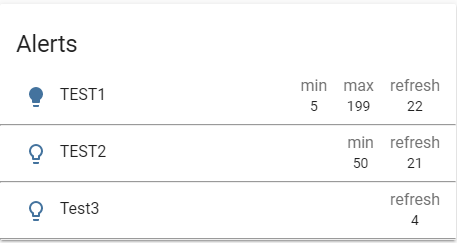

# Attribute Array Card

A Home Assistant Lovelace card that allows you to display an array in the attribute property of an entity.


[](https://github.com/custom-components/hacs)

## Support

[](https://www.buymeacoffee.com/harpesichord)

## Options

| Name             | Type   | Requirement  | Description                                                                                                     |
| ---------------- | ------ | ------------ | --------------------------------------------------------------------------------------------------------------- |
| type             | string | **Required** | `custom:attribute-array-card`                                                                                   |
| entity           | string | **Required** | `domain.my_entity_id`                                                                                           |
| header           | string | **Optional** | Header on the card                                                                                              |
| attribute        | string | **Optional** | Name of the attribute that contains the array to display                                                        |
| icon             | string | **Optional** | An icon to display next to each row or leave blank for no icon                                                  |
| enabled_property | string | **Optional** | A property to check the `enabled_value` against                                                                 |
| enabled_operator | string | **Optional** | A property to to allow any comparison operator to check against `enabled_value`, valid values are `<`, `>`, `<=`, `>=`, `!=`, `==` |
| enabled_value    | string | **Optional** | The value to make `enabled_property` true                                                                       |
| enabled_icon     | string | **Optional** | If set and `enabled_property` matches `enabled_value` the icon next to each row will be replaced with this icon |
| name_property    | string | **Optional** | The property that holds a value to be used as a header on each row                                              |
| item1_property   | string | **Optional** | The property of the item in the first column per row                                                            |
| item2_property   | string | **Optional** | The property of the item in the second column per row                                                           |
| item3_property   | string | **Optional** | The property of the item in the thrid column per row                                                            |

### Enabled Options

The enabled options are a way to display a special icon next to each row when a certain property value matches the expected value.
This can be used as a way of showing an alert for each attribute item.

```json
{
  "attributes": {
    "alerts": [
      {
        "alerted": false,
        "max": 199,
        "min": 5,
        "name": "TEST1",
        "refresh": 22
      },
      {
        "alerted": true,
        "max": 500,
        "name": "TEST2",
        "refresh": 21
      }
    ]
  }
}
```

Take the attribute array alerts for this entity. The `enabled_property` could be set to `alerted` and the `enabled_value` could be set to `true`. In this case the second item would show the special `enabled_icon` next to the row.

### item#\_property

Each row can show upto 3 properties for every item in the array. If an item does not contain that propert nothing will show.

## Examples

### Example 1

Given the following attribute array in your entiy and the card configuration.

```json
{
  "attributes": {
    "alerts": [
      {
        "alerted": true,
        "max": 199,
        "min": 5,
        "name": "TEST1",
        "refresh": 22
      },
      {
        "alerted": false,
        "min": 50,
        "name": "TEST2",
        "refresh": 21
      },
      {
        "alerted": false,
        "name": "Test3",
        "refresh": 4
      }
    ]
  }
}
```

```yaml
- type: 'custom:attribute-array-card'
  header: Alerts
  entity: sensor.thermometer
  attribute: alerts
  name_property: name
  item1_property: min
  item2_property: max
  item3_property: refresh
  enabled_property: alerted
  enabled_value: true
  enabled_icon: 'mdi:lightbulb'
  icon: 'mdi:lightbulb-outline'
```



### Example 2

Given the following attribute array in your entiy and the card configuration.

```json
{
  "attributes": {
    "alerts": [
      {
        "alerted": 50,
        "max": 199,
        "min": 5,
        "name": "TEST1",
        "refresh": 22
      },
      {
        "alerted": 10,
        "min": 50,
        "name": "TEST2",
        "refresh": 21
      },
      {
        "alerted": 30,
        "name": "Test3",
        "refresh": 4
      }
    ]
  }
}
```

```yaml
- type: 'custom:attribute-array-card'
  header: Alerts
  entity: sensor.thermometer
  attribute: alerts
  name_property: name
  item1_property: min
  item2_property: max
  item3_property: refresh
  enabled_property: alerted
  enabled_operator: '>'
  enabled_value: 40
  enabled_icon: 'mdi:lightbulb'
  icon: 'mdi:lightbulb-outline'
```


